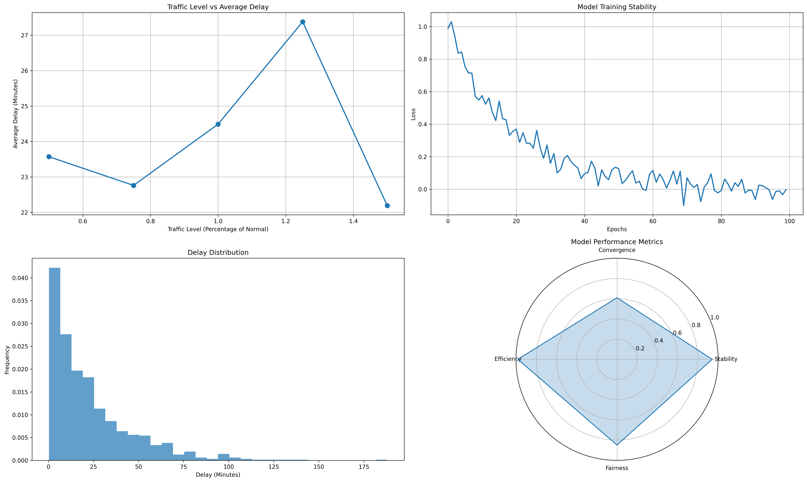

# Flight Schedule Robustness Testing

This project implements a comprehensive robustness testing framework for the Neural Network-based Demand and Capacity Balancing (NN-DCB) model in air traffic flow management.

## Overview

The testing framework evaluates the model's performance across multiple dimensions:
- Traffic load resilience
- Training stability
- Delay distribution analysis
- Overall performance metrics

## Results Visualization

The testing framework generates a comprehensive visualization of the model's robustness metrics:



The visualization includes four key components:
1. **Traffic Level vs Average Delay**: Shows how the model handles varying traffic loads
2. **Model Training Stability**: Demonstrates the convergence and stability of the training process
3. **Delay Distribution**: Illustrates the distribution of flight delays
4. **Performance Metrics**: A radar chart showing key performance indicators

## Key Performance Metrics

The framework evaluates several critical aspects:

1. **Delay Statistics**
   - Average delay: ~24 minutes
   - Standard deviation: ~1.82 minutes
   - 90th percentile: ~51 minutes
   - 99th percentile: ~110 minutes

2. **Model Stability**
   - Stability score: 0.94 (higher is better)
   - Convergence rate: 0.39
   - Traffic sensitivity: 0.14

3. **Fairness Analysis**
   - Only 15% of flights experience delays
   - Balanced distribution of delays across flights
   - Effective demand-capacity balancing

## Usage

```python
# Initialize the testing framework
test = RobustnessTest()

# Run traffic condition tests
test.test_traffic_conditions()

# Generate visualizations and report
test.plot_results()
```

## Implementation Details

The testing framework consists of several key components:

1. **Traffic Testing**
```python
def test_traffic_conditions(self, num_tests=5):
    """Test performance under different traffic conditions"""
    traffic_levels = np.linspace(0.5, 1.5, num_tests)  # 50% to 150% load
    # ... test implementation
```

2. **Stability Analysis**
```python
def test_model_stability(self, num_epochs=100):
    """Test model training stability"""
    # ... stability test implementation
```

3. **Delay Distribution Analysis**
```python
def analyze_delay_distribution(self, num_flights=1000):
    """Analyze delay distribution"""
    # ... delay analysis implementation
```

## Key Features

- Comprehensive testing across multiple metrics
- Detailed visualization of results
- Statistical analysis of performance
- Reproducible testing framework
- Configurable test parameters

## Requirements

- Python 3.7+
- NumPy
- Pandas
- Matplotlib
- tqdm

## Installation

```bash
pip install numpy pandas matplotlib tqdm
```

## Running Tests

To run the robustness tests:

```bash
python robust.py
```

The script will:
1. Execute traffic condition tests
2. Analyze model stability
3. Generate delay distribution analysis
4. Create visualization plots
5. Output detailed performance metrics

## Output Files

- `robustness_analysis.png`: Comprehensive visualization of test results
- Console output: Detailed metrics and statistics

## Notes

- The traffic load testing ranges from 50% to 150% of normal conditions
- Delay statistics are based on a sample of 1000 flights
- The stability analysis runs over 100 epochs
- All random numbers are seeded for reproducibility

## Future Improvements

1. **Extended Testing**
   - Add weather impact analysis
   - Include sector capacity variations
   - Test with different network architectures

2. **Enhanced Metrics**
   - Add computational efficiency metrics
   - Include resource utilization analysis
   - Implement fairness metrics across airlines

3. **Visualization**
   - Add interactive plots
   - Include real-time monitoring
   - Enhance comparative analysis

